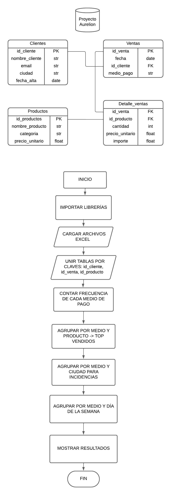

# Presentación

---
# TEMA: RETAIL  - Análisis de los métodos de pago utilizados en las ventas
# PROBLEMA: 
Falta de visibilidad respecto a los métodos de pago utilizados por los clientes.

# SOLUCIÓN:
Desarrollar un sistema en Python para analizar las ventas y detectar patrones de uso de medios de pago.
- Identificar qué medios de pago son los más usados.
- Detectar tendencias o patrones de uso según productos o regiones.
- Tomar decisiones informadas sobre qué servicios financieros priorizar.

# DATASET DE REFERENCIA

## FUENTE
Dataset de la tienda Aurelion, compuesto por 4 archivos de Excel (.xlsx). 

## DEFINICIÓN
Incluye 4 tablas principales distribuidas en 4 archivos distintos: 
- Clientes (Contiene información de los usuarios registrados)
- Productos (Lista de productos disponibles con sus características)
- Ventas (Registra cada transacción realizada por los clientes)
- detalle Ventas (Desglosa los productos vendidos en cada transacción, con cantidades e importes)

## ESTRUCTURA Y TIPO DE DATO
- Clientes: información de los clientes que compran en la tienda.
    - id_cliente (int)
    - nombre_cliente (str)
    - email (str)
    - ciudad (str)
    - fecha_alta (date)
- Detalle_ventas: cantidad y precios de productos vendidos en cada venta.
    - id_venta (int)
    - id_producto (int)
    - nombre_producto (str)
    - cantidad (int)
    - precio_unitario (float)
    - importe (float)
- Productos: artículos que ofrece la tienda según su categoría y precio.
    - id_producto (int)
    - nombre_producto (str)
    - categoria (str)
    - precio_unitario (float)
- Ventas: registra cada transacción del cliente.
    - id_venta (int)
    - fecha (date)
    - id_cliente (int)
    - nombre_cliente (str)
    - email (str)
    - medio_pago (str)
## ESCALA
La base de datos presenta una escala de:
* Clientes: 100 registros.
* Productos: 100 registros.
* Ventas: 120 registros.
* Detalle de ventas: más de 3000 registros (alta granularidad).

# INFORMACIÓN
La tienda puede invertir en mejorar los métodos de pago más demandados. Puede replantear la oferta de los productos con baja salida e incentivar ciertos métodos de pago.

- ¿Cuáles son los métodos de pago más utilizados?
- ¿Qué productos son los más comprados según el método de pago?
- ¿De qué lugares provienen los clientes que usan esos métodos de pago?
- ¿Los clientes usan siempre el mismo método de pago?
- ¿Qué días de la semana se usan más y menos los diferentes métodos de pago?
- ¿Qué datos son necesarios para el análisis del problema?
- ¿Necesitamos nuevos campos de datos para realizar un mejor análisis?

# PASOS
1. Leer los datos desde los archivos excel del dataset(Clientes, Ventas, Productos y Detalle_ventas).
2. Procesar y unificar la información para:
    - Detectar los métodos de pago más frecuentes.
    - Identificar los productos más vendidos y menos vendidos por tipo de pago.
    - Determinar los lugares con mayor incidencia de cada método de pago.
    - Analizar variaciones temporales(por días de la semana o fechas específicas).
3. Generar gráficos y reportes para una mejor interpretación.

# PSEUDOCÓDIGO MENÚ
1. Tema
    1. Imprimir temática
2. Problema
    1. Imprimir problemática
3. Solución 
    1. Importar librerías(pandas y numpy)
    2. Cargar los datos(los 4 datasets)
    3. Unir tablas por claves
        - ventas_detalle ← unir(ventas, detalle, por="id_venta")
        - data ← unir(ventas_detalle, clientes, por="id_cliente")
        - data ← unir(data, productos, por="id_producto")
    4. Analizar métodos de pago:
        - listar los medios de pago
        - contar los métodos de pago
        - ver los métodos de pago más usados (contar)
    5. Analizar productos por método de pago:
        - agrupar los métodos de pago según el id del producto
        - sumar cantidad vendida
        - obtener top productos por métodos de pago
    6. Analizar ciudades:
        - agrupar datos de métodos de pago según la ciudad
        - contar clientes por métodos de pago y ciudad
    7. Analizar días de la semana:
        - extraer el día de la semana
        - agrupar por medio_pago y dia_semana
        - contar número de ventas
    8. Mostrar resultados
        - imprimir frecuencia de medios de pago
        - imprimir productos más vendidos por medio
        - imprimir ciudades con mayor incidencia
        - imprimir uso por día de semana
4. Base de datos
    1. Imprimir el contenido de Clientes, Ventas, Productos y Detalle_ventas.

# DIAGRAMA DEL PROGRAMA

# SUGERENCIAS Y MEJORAR APLICADAS CON COPILOT
